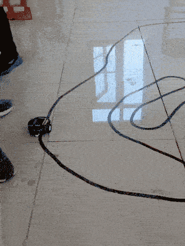

# Line-Following Robot with PID Control

An autonomous line-following robot using five IR sensors and PID control for smooth, stable line tracking. The robot follows a black line on a white surface with minimal oscillation and flickering compared to traditional bang-bang control methods.

This implementation was tested on *AlphaBot2-Ar* after initial experiments with a custom robot build. The AlphaBot2-Ar's precise sensor array spacing and robust hardware configuration proved essential for optimal PID performance.

## Working Principle

1. **Sensors**:
   - Five IR sensors facing downwards arranged in a linear array at the front of the robot
   - Sensors detect the position of the black line relative to the robot's center
   - Automatic calibration routine measures minimum and maximum reflectance values for each sensor

2. **Calibration Process**:
   - On startup, the robot performs automatic calibration for approximately 10 seconds
   - During calibration, the user must expose all sensors to both black (line) and white (background) surfaces
   - The system records minimum and maximum values for each sensor to adapt to different lighting conditions and surface materials
   - Calibrated values are used to normalize sensor readings during operation

3. **Position Detection**:
   - The `readLine()` function returns a weighted average position value from 0 to 4000
   - Each sensor is assigned a position: sensor 0 = 0, sensor 1 = 1000, sensor 2 = 2000, sensor 3 = 3000, sensor 4 = 4000
   - Position is calculated using the formula: `(0×value0 + 1000×value1 + 2000×value2 + 3000×value3 + 4000×value4) / (value0 + value1 + value2 + value3 + value4)`
   - Position 2000 indicates the line is centered under the middle sensor (sensor 2)
   - Values < 2000 indicate the line is toward the left side
   - Values > 2000 indicate the line is toward the right side
   - Intermediate values provide precise sub-sensor position information

4. **PID Control Logic**:
   - **Error Calculation**: `error = position - 2000` (negative = left, positive = right)
   - **Proportional (P)**: Responds to current error magnitude (`proportional / 5`)
   - **Integral (I)**: Eliminates steady-state error over time (`integral / 10000`)
   - **Derivative (D)**: Dampens oscillations and predicts future error (`derivative * 30`)
   - **Power Difference**: PID output adjusts the speed difference between left and right motors

5. **Motor Control**:
   - Base speed is set to a maximum value (70 in this implementation)
   - PID output creates a speed differential between motors for steering
   - When line is to the right: left motor runs faster, right motor slows down
   - When line is to the left: right motor runs faster, left motor slows down

## Demo

## Usage Instructions
1. **Power on** the robot and place it near the line
2. **Calibration Phase** (first 10 seconds):
   - Move the robot side-to-side over the line so all sensors see both black and white
   - Or manually move a black/white surface under the sensors
3. **Operation**: Place the robot on the line and it will begin following automatically

## Improvements Over Bang-Bang Control
- **Smoother Motion**: PID control eliminates the bumpy, oscillating behavior of simple threshold-based line following
- **Better Line Tracking**: Multiple sensors provide precise position information rather than just left/right detection
- **Adaptive Response**: The derivative term prevents overshooting and creates smoother curves
- **Handles Curves Better**: Continuous position feedback allows the robot to anticipate and smoothly navigate curved lines

## Problems Faced
- **Custom Robot Build Limitations**: Initial attempts with a custom-built robot faced challenges:
  - IR sensors were spaced too far apart, reducing position resolution
  - Inconsistent sensor mounting led to calibration difficulties
  - Power supply issues caused unreliable sensor readings
- **Sensor Placement**: Optimal sensor spacing is critical for accurate line position detection. Too wide and the robot loses precision; too narrow and it can't detect sharp turns.
- **PID Gain Tuning**: Finding the optimal PID constants (Kp = 1/5, Ki = 1/10000, Kd = 30) required extensive experimentation
- **Calibration Sensitivity**: Automatic calibration requires proper exposure to both black and white surfaces. Poor calibration leads to incorrect line position readings and erratic behavior.

## Assumptions
- The robot operates on a black line on a white surface
- Line width is appropriate for the sensor array spacing
- Surface is flat and provides consistent IR reflectance
- The robot starts on or near the line before operation
- Calibration is performed properly by exposing sensors to both black and white surfaces
- Operating environment has relatively stable lighting conditions
- Line curves are gradual enough for the robot's turning radius